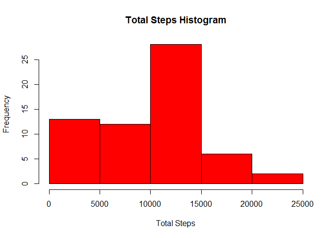
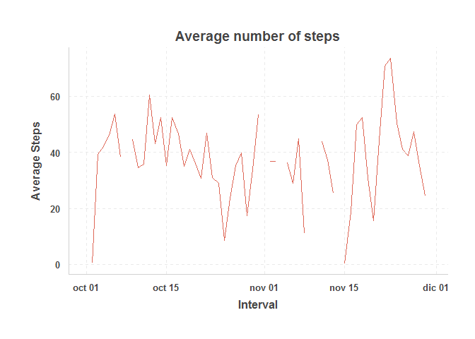
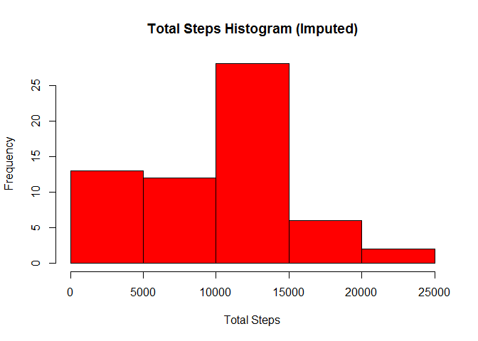
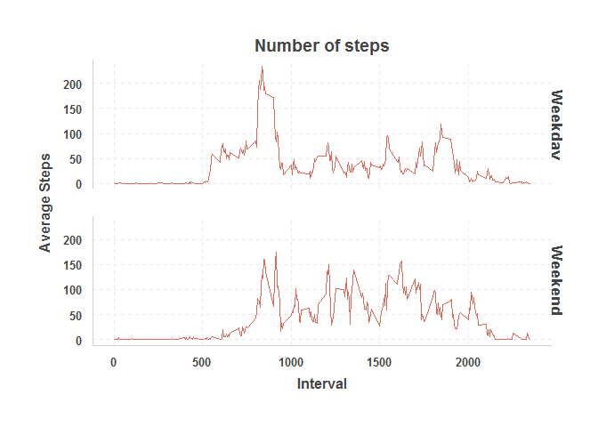

# Reproducible Research: Peer Assessment 1
Hector Munoz  

```r
knitr::opts_chunk$set(echo = TRUE)
```


## Loading and preprocessing the data

```r
    suppressPackageStartupMessages(suppressWarnings(library(dplyr)))
    suppressPackageStartupMessages(suppressWarnings(library(data.table)))
    suppressPackageStartupMessages(suppressWarnings(library(dtplyr)))
    suppressPackageStartupMessages(suppressWarnings(library(lubridate)))
    suppressPackageStartupMessages(suppressWarnings(library(ggplot2)))
    suppressPackageStartupMessages(suppressWarnings(library(ggthemr)))
    setwd("C:\\Users\\Hp\\RepData_PeerAssessment1\\RepData_PeerAssessment1")    
    activity <- read.csv("activity.csv", stringsAsFactors = F) %>% 
        mutate(date = ymd(date)) %>%  tbl_dt()
```


## What is mean total number of steps taken per day?

```r
    total_steps <- activity[,.(total_steps = sum(steps, na.rm = T)), by =date]
    
    hist(total_steps$total_steps, col = "red",
         xlab = "Total Steps", main = "Total Steps Histogram")
```

<!-- -->

```r
    (total_steps[,mean(total_steps)]) # Mean steps per day
```

```
## [1] 9354.23
```

```r
    (total_steps[,median(total_steps)]) # Median steps per day
```

```
## [1] 10395
```


## What is the average daily activity pattern?

```r
        average_steps <- activity[,.(average_steps = mean(steps, na.rm = T)), by =date]
        
        ggthemr("pale")
        ggplot(average_steps, aes(x = date, y = average_steps)) +
            geom_line() + xlab("Interval") + ylab("Average Steps") +
            ggtitle("Average number of steps") 
```

```
## Warning: Removed 2 rows containing missing values (geom_path).
```

<!-- -->

```r
            max_row <- which.max(average_steps$average_steps)
            (average_steps[max_row,date]) # The 5 minute intervals in november the 23rd are on average the highest
```

```
## [1] "2012-11-23"
```


## Imputing missing values

```r
        (activity[is.na(steps), .N])
```

```
## [1] 2304
```

```r
        mean_steps <- activity[,.(mean_steps = mean(steps, na.rm = T)), by = date]
        mean_steps[is.na(mean_steps), mean_steps := 0]
        imputed_activity <- copy(activity) %>% merge(y = mean_steps, by = "date") %>% tbl_dt()
        imputed_activity[, steps := as.double(steps)]        
        imputed_activity[is.na(steps), steps := mean_steps]        
        imputed_activity[is.na(steps), steps := 0]        
        imputed_activity[, mean_steps := NULL]        
        
        total_steps_imputed <- imputed_activity[,.(total_steps = sum(steps, na.rm = T)), by =date]
        hist(total_steps_imputed$total_steps, col = "red",
             xlab = "Total Steps", main = "Total Steps Histogram (Imputed)")
```

<!-- -->

```r
        (total_steps_imputed[,mean(total_steps)]) # Mean steps per day
```

```
## [1] 9354.23
```

```r
        (total_steps_imputed[,median(total_steps)]) # Median steps per day
```

```
## [1] 10395
```

```r
        # histogram and means are the same, so is the median
```


## Are there differences in activity patterns between weekdays and weekends?

```r
        weekend_ <- c("sábado","domingo")
        activity[!weekdays(date) %in% weekend_, day_type:= "Weekday"]
        activity[weekdays(date) %in% weekend_, day_type:= "Weekend"]
        activity[, day_type:= as.factor(day_type)]

        average_steps_daytype <- activity[,.(average_steps = mean(steps, na.rm = T)), 
                                          by =.(interval, day_type)]
        
        ggplot(average_steps_daytype, aes(x = interval, y = average_steps)) +
            geom_line() + facet_grid(day_type~.) + ylab("Average Steps") + xlab("Interval") +
            ggtitle("Number of steps")
```

<!-- -->

```r
        # The number of steps in the weekends seems to be higher, indicating more activity 
```


